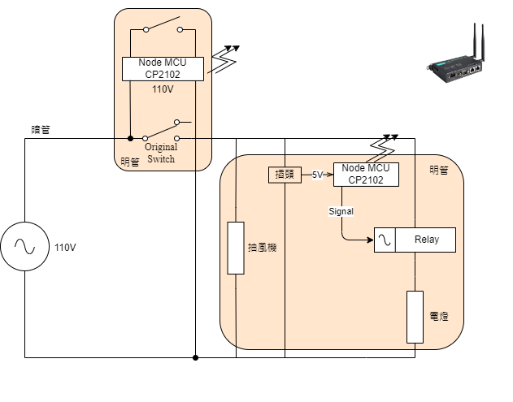

# side_project_lightbulb_control

## Project Purpose
* In order to deal with the inconvenient experiment on lightbulb of bathroom, I decided to write some code and implent the circuit. Specifically speaking about the inconvenient, I wish exhaust fan in bathroom can always work without switch control it. But unfortunately, it has connected with lightbulb circuit at the beginning, and the circuit hided in the wall that I can't change the circuit directly.
* The original circuit diagram is as the bottom left and the revised circuit diagram v1 is as the bottom right

## Arduino Circuit Diagram
* Version 1
	
	* As the circuit above, when IR remote sensor received *any* infrared, it'll illuminate LED just like a demo that it connects with an actual lightbulb.
	* Cons:
		1. It must carry a mobile charger. And like I said, the circuit of the lightbulb hides in the wall, so the volume is too big to hide on the roof.
		2. The portable charger must replace regularly and that is much more inconvenient.
		3. Using IR remote sensor to control is not intuitive. When you'd like to turn on a lightbulb, you must find a remote controller first? That is not good obviously.

* Version 2
	
	* How does it work?
		* I used two WIFI models (Node MCU CP2102) to control the lightbulb and switch that we pressed.
		* If I turn on the switch, the CP2102 WIFI model will send a signal to WIFI AP and WIFI AP will resend it to another CP2102 hidden in the roof to illuminate the lightbulb.
	* Pros
		1. It solved the portable charger that will make the volume too big to hide. I just use a useful plug as a transformer to output 5V DC and supply to the WIFI  model.
		2. We don't need to replace the charger because I just use an endless power(though I know it's not a real endless) connect to AC 110 V directly.
		3. I used a simple switch to demo our habit instead of using an IR remote. I make it more convenient.

## Reference
* [Relay1](http://a-chien.blogspot.com/2016/07/arduino_7.html)
* [Relay2](https://blog.jmaker.com.tw/arduino-relay/)
* [Relay3](https://crazymaker.com.tw/arduino-how-to-use-relay/)
* [Relay4](https://www.youtube.com/watch?v=8ULB8-CvbbE)
* [IRRemote1](https://blog.xuite.net/aminyeh0825/blog/589725602#)
* [IRRemote2](https://www.youtube.com/watch?v=5bfJTu5tekY&t=663s)
* [WIFI1](https://www.youtube.com/watch?v=q-14MtNWltg)
* [WIFI2](https://blog.hoyo.idv.tw/?p=4403)
* [NodeMCU腳位](http://www.taichi-maker.com/homepage/esp8266-nodemcu-iot/esp8266-nodemcu-tutorial-index/nodemcu-board/

***

## Recently Page for Ver.2
* [1](https://lolwarden.pixnet.net/blog/post/82031214-%2A%E6%95%99%E5%AD%B8%2Aarduino-wifi%28esp8266%29-%E5%88%9D%E6%AC%A1%E4%B8%8A%E6%89%8B%E6%87%89%E7%94%A8)
* [2](https://lolwarden.pixnet.net/blog/post/82060758)
* [3](https://ithelp.ithome.com.tw/articles/10240199)
* [4](https://www.chosemaker.com/board/esp32/lesson-3/)
* [Very Important](https://honeststore.com.tw/esp8266-wifi-between-client-server/)
* 